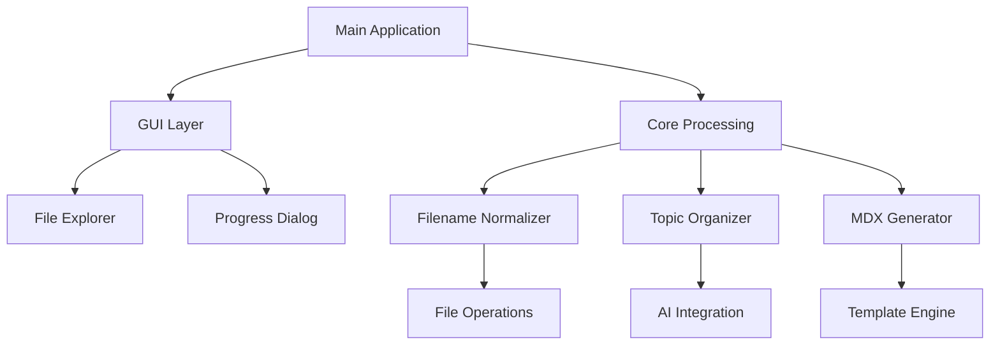

<div align="center">

# 🚀 MDX-Generator

**A powerful blog generation and file management tool that leverages GenAI to create topic-wise content files in MDX format.**

[](https://opensource.org/licenses/MIT)
[](https://www.python.org/)
[](http://makeapullrequest.com)

[Features](#-features) • [Installation](#-installation) • [Usage](#-usage) • [Documentation](#-documentation) • [Contributing](#-contributing)

</div>

---

## 📋 Table of Contents

- [Overview](#-overview)
- [Features](#-features)
- [Installation](#-installation)
- [Project Structure](#-project-structure)
- [Usage](#-usage)
  - [GUI Application](#gui-application)
  - [Command Line Tools](#command-line-tools)
- [Configuration](#-configuration)
- [Technical Details](#-technical-details)
- [Contributing](#-contributing)
- [License](#-license)

---

## 🎯 Overview

MDX-Generator helps content creators and developers efficiently manage and generate blog content using Markdown and MDX files. The tool provides utilities for normalizing filenames, organizing content by topics, and leveraging generative AI to assist in content creation.

### Key Benefits
- ✅ **Automated Content Organization** - Organize your blog posts by topics
- ✅ **URL-Friendly Filenames** - Automatically normalize filenames for web compatibility
- ✅ **GenAI Integration** - Leverage AI for content generation assistance
- ✅ **User-Friendly Interface** - Both GUI and CLI options available
- ✅ **Metadata Management** - Automatic synchronization of content metadata

---

## ✨ Features

| Feature | Description |
|---------|-------------|
| 🖱️ **Drag & Drop GUI** | User-friendly interface with drag and drop functionality |
| 📝 **Filename Normalization** | Convert filenames to URL-friendly format |
| 📊 **Metadata Management** | Automatic organization and updating of content metadata |
| 📈 **Progress Tracking** | Visual progress indication for all operations |
| ⚙️ **Configurable Settings** | Customizable processing options |
| 🤖 **GenAI Integration** | AI-powered content generation assistance |
| 🔄 **Batch Processing** | Process multiple files and directories simultaneously |

---

## 📦 Installation

### Prerequisites
- Python 3.8 or higher
- pip package manager

### Quick Install

```bash
# Clone the repository
git clone https://github.com/astrofusion/MDX-Generator.git

# Navigate to the project directory
cd MDX-Generator

# Install dependencies
pip install -r requirements.txt
```

### Development Install

```bash
# For development with additional tools
pip install -r requirements-dev.txt
```

### Alternative: Using Virtual Environment (Recommended)

```bash
# Create virtual environment
python -m venv .venv

# Activate virtual environment
# On macOS/Linux:
source .venv/bin/activate
# On Windows:
venv\Scripts\activate

# Install dependencies
pip install -r requirements.txt
```

---

## 📁 Project Structure

```
MDX-Generator/
├── 📄 README.md                    # Project documentation
├── 🐍 main.py                      # Main application entry point
├── 📋 requirements.txt             # Python dependencies
├── 📋 requirements-dev.txt         # Development dependencies
│
├── 🔧 core/                        # Core Processing Modules
│   ├── 00_normalize_filenames.py   # Filename normalization & metadata sync
│   ├── 01_content_analyzer.py      # Content analysis utilities
│   ├── 02_topic_organizer.py       # Topic-based organization
│   └── 03_mdx_generator.py         # MDX file generation
│
├── 🖥️ gui/                         # Graphical User Interface
│   ├── main_window.py              # Primary application window
│   ├── progress_dialog.py          # Progress tracking dialog
│   ├── settings_dialog.py          # Configuration interface
│   └── components/                 # UI components
│       ├── file_tree.py            # File explorer component
│       └── preview_panel.py        # Content preview
│
├── 🛠️ utils/                       # Utility Modules
│   ├── logging_utils.py            # Logging configuration
│   ├── file_operations.py          # File handling utilities
│   ├── config_manager.py           # Settings management
│   └── ai_integration.py           # GenAI connectivity
│
├── 📝 templates/                   # Content Templates
│   ├── blog_post.mdx              # Default blog post template
│   ├── article.mdx                # Article template
│   └── custom/                    # User-defined templates
│
├── 📤 output/                      # Generated Content
│   ├── processed/                 # Processed blog files
│   └── metadata/                  # Generated metadata files
│
└── 🧪 tests/                       # Test Suite
    ├── test_core/                 # Core module tests
    ├── test_utils/                # Utility tests
    └── test_integration/          # Integration tests
```

---

## 🚀 Usage

### GUI Application

Launch the graphical interface for an intuitive experience:

```bash
python main.py
```

#### GUI Features:
- **📁 Drag & Drop**: Simply drag your content directories into the application
- **✅ Processing Options**: Select which operations to perform
- **⚙️ Settings**: Configure behavior through the settings dialog
- **📊 Progress Monitoring**: Real-time progress visualization

### Command Line Tools

For automation and scripting, use the CLI tools directly:

#### 00 - Normalize Filenames
Converts filenames to URL-friendly format by removing special characters and standardizing naming conventions.

```bash
# Scan current directory
python core/00_normalize_filenames.py

# Scan specific directory
python core/00_normalize_filenames.py /path/to/directory

# Dry run to just see what would change
python core/00_normalize_filenames.py /path/to/directory --dry-run

# Skip confirmation prompt
python core/00_normalize_filenames.py /path/to/directory --yes
```

#### Organize by Topics

```bash
# Organize content by detected topics
python core/02_topic_organizer.py /path/to/content --auto-detect

# Use specific topics
python core/02_topic_organizer.py /path/to/content --topics "tech,design,productivity"
```

#### Generate MDX Files

```bash
# Generate MDX from markdown files
python core/03_mdx_generator.py /path/to/markdown/files --template blog_post
```

---

## ⚙️ Configuration

### Settings File

The application uses a `config.json` file for persistent settings:

```json
{
  "processing": {
    "normalize_filenames": true,
    "create_backups": true,
    "update_metadata": true
  },
  "ai": {
    "provider": "openai",
    "model": "gpt-3.5-turbo",
    "api_key": "your-api-key-here"
  },
  "output": {
    "format": "mdx",
    "include_frontmatter": true,
    "preserve_structure": true
  }
}
```

### Environment Variables

```bash
# AI Configuration
export OPENAI_API_KEY="your-openai-api-key"
export AI_MODEL="gpt-4"

# Application Settings
export MDX_OUTPUT_DIR="./output"
export LOG_LEVEL="INFO"
```

---

## 🔧 Technical Details

### Core Functionality

| Module | Purpose | Key Features |
|--------|---------|--------------|
| **File Normalization** | URL-friendly filenames | Space/special char replacement, case handling |
| **Metadata Sync** | Keep `_meta.json` updated | Automatic filename tracking, content analysis |
| **Progress Tracking** | User feedback | Real-time updates, error reporting |
| **Error Handling** | Robust operation | Exception catching, detailed logging |

### Architecture



### Extending the Tool

Adding new processing modules is straightforward:

1. **Create Module**: Add `XX_module_name.py` to the `core/` directory
2. **Naming Convention**: Use `XX` for execution order (00, 01, 02, etc.)
3. **Interface**: Implement `main(directory)` function
4. **Integration**: Module will be auto-detected by the GUI

**Example Module Structure:**

```python
def main(directory: str, options: dict = None) -> bool:
    """
    Process the given directory.
    
    Args:
        directory: Path to process
        options: Configuration options
    
    Returns:
        bool: Success status
    """
    # Your processing logic here
    pass
```

---

## 🤝 Contributing

We welcome contributions! Here's how you can help:

### 🐛 Reporting Issues
- Use the [issue tracker](https://github.com/yourusername/MDX-Generator/issues)
- Include detailed reproduction steps
- Provide system information

### 💻 Development Workflow

```bash
# 1. Fork and clone
git clone https://github.com/yourusername/MDX-Generator.git
cd MDX-Generator

# 2. Create feature branch
git checkout -b feature/amazing-feature

# 3. Make changes and test
python -m pytest tests/

# 4. Commit with clear message
git commit -m "Add: amazing new feature that does X"

# 5. Push and create PR
git push origin feature/amazing-feature
```

### 📝 Code Style
- Follow PEP 8 guidelines
- Use type hints where possible
- Add docstrings to functions
- Write tests for new features

### 🧪 Testing

```bash
# Run all tests
python -m pytest

# Run with coverage
python -m pytest --cov=core --cov=utils

# Run specific test category
python -m pytest tests/test_core/
```

---

## 📄 License

This project is licensed under the **MIT License** - see the [LICENSE](LICENSE) file for details.

---

## 🙏 Acknowledgments

- Thanks to all contributors who help improve this project
- Built with Python and modern development practices
- Inspired by the need for better content management tools

---

<div align="center">

**⭐ If you find this project helpful, please consider giving it a star!**

[Report Bug](https://github.com/yourusername/MDX-Generator/issues) • [Request Feature](https://github.com/yourusername/MDX-Generator/issues) • [Documentation](https://github.com/yourusername/MDX-Generator/wiki)

</div>

---

> **Note**: This project is under active development. Check for updates regularly and feel free to contribute!
